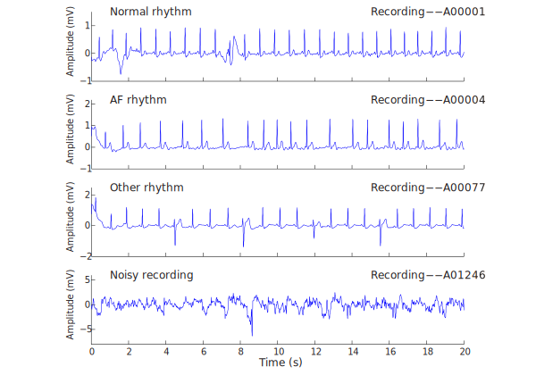

# Atrial Fibrillation Classification from short ECG (CINC 2017 Challenge)

This project is inspired from CINC challenge which is aimed to encourage the development of algorithms to classify, whether short single lead ECG recordings (between 30 s and 60 s in length) show normal sinus rhythm, atrial fibrillation (AF), an alternative rhythm, or is too noisy to be classified. 

In this project, we start by building a simpler two-class classifier distinguishing between normal sinus rhythm and abnormal rhythm (atrial fibrillation included) by excluding the noisy recordings. We thus used 7,418 out of the original 8,528 training data recordings. They have been converted into 'npz' format from the original MATLAB V4 WFDB-compliant format. 

We performed the following 
1. Even though, RR intervals are already provided, we first build an algorithm to extract RR intervals using the Pan-Tompkins method and measure the accuracy performance of the algorithm.
2. We processed and extracted features from the RR intervals data for our classifier.
3. Build and compute the performance of a 2-class random forest classifier (between Normal and Abnormal (Other and Afib) rhythms)
4. Build and compute the performance of a 3-class random forest classifier (between Normal, Other and Afib rhythms)

We then perform additional analyses to help improve the accuracy of the classifier  
1. Adding more features requiring additional processing and features extraction from the raw signal
2. Performing a grid search for hyperparameter tuning
3. Comparing performance among 8 common classifiers which includes hyperparameter tunning for each

 
 
